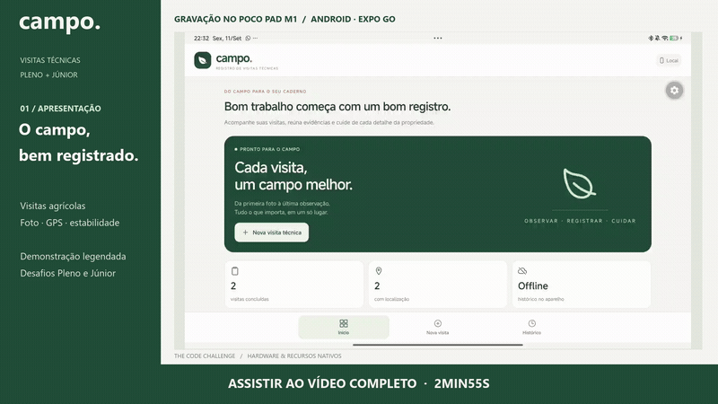

# Demonstração do Campo

[Abrir o MP4](campo-demo.mp4) · [Legendas SRT](campo-demo.pt-BR.srt) · [Capa estática](campo-demo-capa.png)

Vídeo de **2min55s**, em **1920 × 1080**, com legendas em português incorporadas à imagem. Sem faixa de áudio. A divisão de capítulos acompanha o [roteiro](../ROTEIRO_VIDEO.md).

## Origem das imagens

As capturas foram feitas em **11 de setembro de 2026**, no **POCO Pad M1**, usando o **Expo Go 57.0.9** e o app deste repositório. A edição reúne sessões independentes de teste; há cortes e pausas para leitura dos alertas. Os painéis de código são trechos dos arquivos do projeto, e os resultados de `npm test` foram capturados de uma execução real.

Foi criada uma visita com dados de demonstração. A foto mostra o ambiente de teste; a localização foi capturada pelo aparelho e sua precisão ficou em aproximadamente **21,3 m**. As coordenadas exatas foram ocultadas no vídeo. A conclusão estável registrou um pico de **1,03g**.

## Alcance da validação

- **No tablet:** preenchimento, captura de foto e localização, permissão de câmera bloqueada, abertura das configurações, recuperação da câmera, conclusão estável, consulta de histórico e foto, alerta de GPS desligado e rotação do formulário. A visita também continuou disponível após reabrir o Expo Go.
- **Offline:** consulta com o app previamente carregado, Wi-Fi desligado e conexão com o servidor pelo USB removida. Não é uma demonstração de partida totalmente offline de uma compilação própria.
- **Automatizado:** o pico transitório de **2,01g** é demonstrado pelo teste de `MotionWindow`, identificado na tela. Não foi gravado um movimento físico acima de 2g nem uma nova tentativa após esse bloqueio no aparelho.
- **Verificações:** 19 testes de domínio aprovados e TypeScript sem erros. Os testes automáticos complementam a demonstração no dispositivo.

A câmera, a localização, o Wi-Fi e a rotação automática foram restaurados após os testes. O [checklist](../VALIDACAO.md) distingue os resultados obtidos dos casos ainda pendentes.

## Arquivos e reprodução

O MP4 usa H.264 e contém as legendas visíveis, para funcionar sem configuração adicional de legendas. O SRT é uma cópia editável das mesmas explicações. A prévia GIF e a capa PNG são atalhos visuais para o vídeo completo.

Os links do README são relativos ao repositório. Ao publicar as alterações, inclua a pasta `docs/video` junto com o README para que a prévia e o vídeo fiquem acessíveis no GitHub. Se o visualizador não reproduzir o MP4, baixe o arquivo e abra-o em um reprodutor de vídeo.
